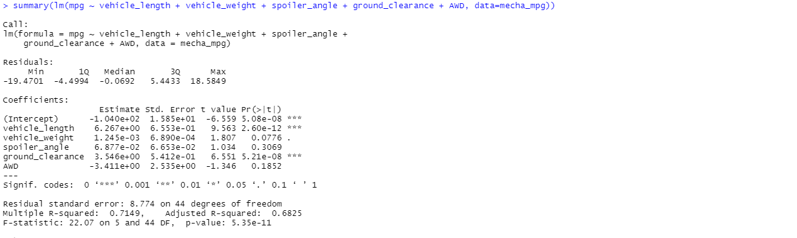

# 15_MechaCar_Statistical_Analysis
***

## Overview:
Jeremy is new to the team at AutosRUs, but has the experience in analysis they are looking for when their newest prototype the *MechaCar* is suffering from production troubles. Let's team up with Jeremy and his data analytics team-- we're called in to review production data and advise the manufactuing team of what we find! RRRRev up those engines, and let's get started.

### Linear Regression to Predict MPG

Jeremy and his team utilized a data set with 50 prototype MechaCars and evaluated many different variables to utilize linear regression in predicting the mpg of the MechaCar. Variables included: vehicle length, vehicle weight, spoiler angle, drive train, and ground clearance.

The appropriate csv was read into a data frame. Then using the dplyr package, linear regression was performed to pass in all six variables.

Then using the summary() function, we determined the p-value and the r-squared values.

Assuming a .05 significance level, the individual p-value results show that the vehicle weight, spoiler angle and the all wheel drive variables are greater than our significance level. They are statistically likely to provide random amounts of variance to the linear model. Therefore, for these variables there is sufficient evidence **not to reject** the null hypothesis. There is not a significant difference in the dependent variable (mpg) between spoiler angle or all wheel drive. *Vehicle weight, spoiler angle and all-wheel drive do not appear to have a significant effect on mpg.*

On the other hand, vehicle length and ground clearance all show p-value results lower than our significance level. They are statistically unlikely to provide random amounts of variance to the linear model. Therefore, for these variables there is sufficient evidence **to reject** the null hypothesis. There is a significant difference in the dependent variable (mpg) and the vehicle length, weight and ground clearance. *Vehicle length and ground clearance have a significant effect on mpg.*

The r-squared value is .71, which means that roughly 71% of the variability of the mpg predictions may be explained using this model. Overall, this model does a good job of predicting the prototypes. The p-value for this model is 5.35e-11

### Summary Statistics on Suspension Coils

Working with a Suspension Coil dataset, Jeremy now tasks your crew with summarizing manufacturing production data pulled from multiple lots, but how will we know if the data around the suspension coil's PSI is consistent?  Using the summarize() function, a data frame was created that shows the mean, median, variance, and standard deviation of the suspension coil’s PSI.

The group created another dataframe by breaking the data apart further for a closer look at individual lots:

In reviewing the above images, Jeremy is able to determine the current manufacturing data meets the design specification of under 100 lbs/ square inch for a suspension coil. For a total falling well under at **62.3**, but we see lot 3 with an outlier at **170.3 PSI**

***

### T-Test on Suspension Coils

Jeremy, you and the crew write a t-test for the suspension coils to determine if the overall manufacturing lots and on each individual lot to determine if overall; and individually by lot, they were statistically different from the population mean of 1,500 pounds per square inch.

**Overall T-Test**

The results of the first t-test reveal that the sample mean is not statistically different from the population mean of 1500 PSI with a p-value of 0.06. There is **not enough evidence to reject** the null hypothesis with a significance level above 0.5.

**T-Test, Lot 1**

**T-Test, Lot 2**

For Lots 1 and 2, the mean and p-values are higher than the .05 significance level. We can conclude that there is sufficient evidence **not to reject** the null hypothesis. The results are *not* statistically different from the population mean of 1,500 pounds per square inch. 

**T-Test, Lot 3**

Conversely for Lot 3, the p-value for Lot 2 is 0.04. This is less than the .05 significance level. We can conclude that there is sufficient evidence **to reject** the null hypothesis. For this lot, the results *ARE* statistically different from the population mean of 1,500 pounds per square inch. 

*The manufacturing process should be examined to see what happened in the production of this lot that caused the variance.*

## Study Design: MechaCar vs Competition [as it relates to price]

I would begin by collecting data across all manufacturers for:

- Original Price
- MPG
- Cost of Ownership
- Resale Value

The null hypothesis would be that the MechaCar is priced correctly based on the metrics provided. The alternative hypothesis would then be that MechaCare is not priced correctly based on the metrics provided.

This would suggest using a multiple linear regression test to determine which factors have the biggest impact on price. At that point we should be able to provide data to either accept or reject the null hypothesis.